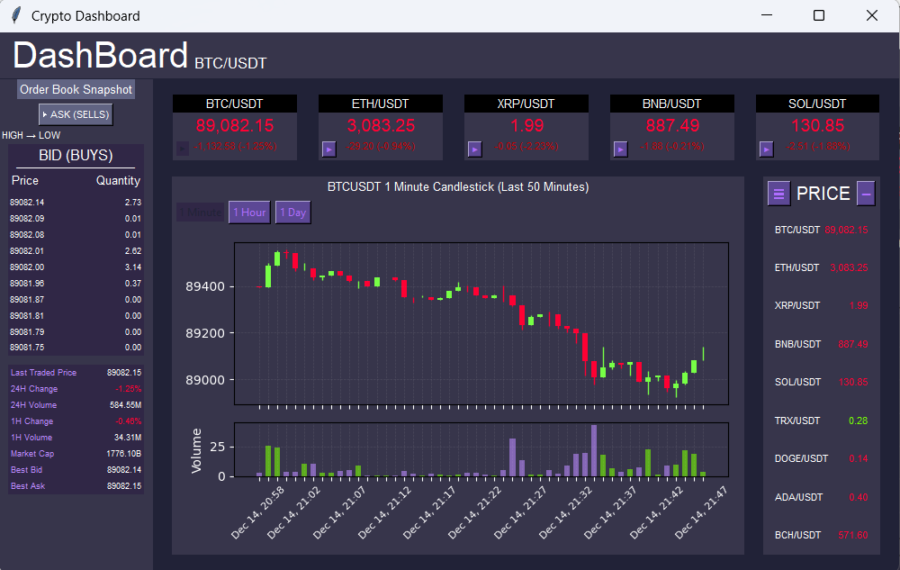
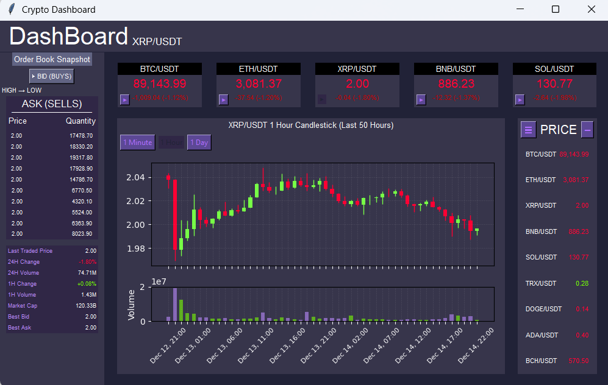
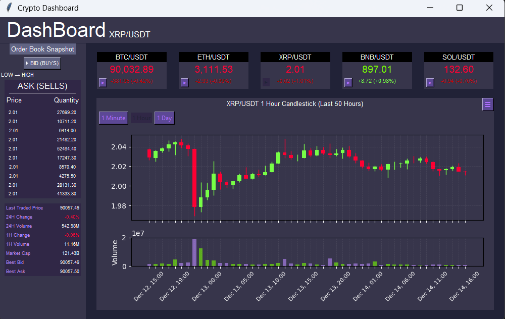
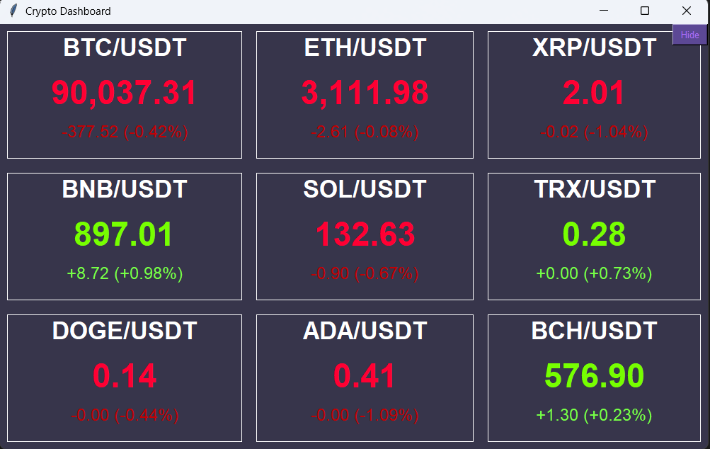

# Crypto Trading Dashboard

A real-time cryptocurrency dashboard using Binance API,
built with Python and Tkinter.

# Project Overview
This project is a desktop cryptocurrency trading dashboard built with Python and Tkinter, using Binance API as the data source.
It displays real-time market data such as price, candlestick chart with volume, order book, and statistics in a single graphical interface.

## Main Features
- **Real-time** price ticker
- **Auto refresh**
- Statistics table
- Candlestick chart with volume
- Interval switch (1m / 1h/ 1d)
- Order book (bid / ask)
- Statistics table
- **Save setting**

## Requirements
- Python
- tkinter
- websocket-client
- requests
- numpy
- matplotlib

## Images
### Main dashboard

### Change main coin and interval

### Hide panel

### Full real-time price and percent

## Controls
- Click button left-bottom corner of coin name to change main trading pair
- Use interval buttons to switch between 1m / 1h / 1d
- Panels can be hidden or shown
- Data updates automatically

## Project Structure
    project/
    ├── main.py                      # Application Entry Point
    ├── config.py                    # Global Configuration
    ├── components/
    │ ├── __init__.py
    │ ├── candle_stick.py            # Candlestick Chart
    │ ├── crypto_price.py            # Real-time Price Tickers
    │ ├── main_crypto_price.py       # Main crypto display 
    │ ├── orderbook.py               # Order Book Table
    │ ├── stat_table.py              # Market Statistics Table
    │ └── overall_crypto_price.py    # Full List Crypto Panel
    ├── utils/
    │ ├── __init__.py
    │ ├── api.py                     # API Helper Functions
    │ └── storage.py                 # Save/Load Logic
    ├── requirements.txt             # Requirements Module
    ├── settings.json                # Save File for User Settings
    └── README.md
## API
- ### Rest API
    Used for data (Klines) and market cap (CoinGecko)
- ### WebSocket Stream: 
    Used for live ticker (@ticker), order book (@depth) and stat table (@trade).

## How to run 
### 1. Install Python
- Required: Python
### 2. Install requirment
    pip install -r requirements.txt
### 3. Run program
    python main.py

## How It Works
- ### Data Fetching
    Data is sourced from the Binance public API.
- ### Real-time Data
    WebSocket connections by websocket-client, used for price, order book updates, and stat table.
- ### GUI Update
    Tkinter's `after()` method is for scheduling UI updates from the background WebSocket onto the main GUI, preventing the application from freezing.
- ### Charting
    Matplotlib is integrated into Tkinter using FigureCanvasTkAgg to render candlestick charts.

## Known Issues
- **UI Freezing (Candlestick)**: The UI may freeze every 5 seconds because the `requests.get()` call for candlestick data is currently performed on the Main Thread.
- **Slow Network**: Performance may degrade on poor network conditions.
- **Reconnection Logic**: Automatic WebSocket reconnection logic is not fully implemented for robust error handling.

## Code Overview

This project each component is responsible for a specific part of the application.

### Entry Point
- `main.py`  
Start the main Tkinter window, loads configurations, and assembles all UI components.

### Configuration
- `config.py`  
Stores global configuration such as colors, UI styles, and list of cryptocurrency symbols.

### Components
- `components/candle_stick.py`  
Renders the candlestick chart and volume bar using Binance kline data.

- `components/crypto_price.py`  
Displays real-time price updates for individual cryptocurrencies.

- `components/main_crypto_price.py`  
Shows the currently selected main cryptocurrency and other main cryptocurrency.

- `components/orderbook.py`  
Displays top bid and ask order book data.

- `components/stat_table.py`  
Shows market statistics such as price, market cap, volume, change,best bid/ask.

- `components/overall_crypto_price.py`  
Displays a list of available cryptocurrencies and their real-time price and change percent.

### Utilities
- `utils/api.py`
Handles communication with Binance REST and WebSocket APIs.

- `utils/storage.py`  
Saves and loads user settings.

- `utils/settings.json`  
Stores application settings.
